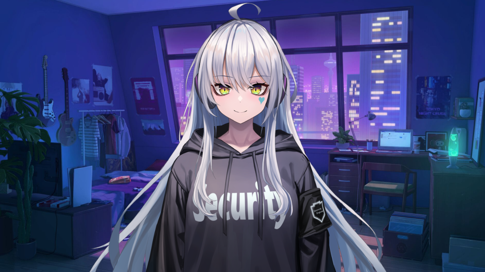

# VTuber's AI Anime

VTuber's AI with anime voice , using tts and speech recognize.

<p align="center">
  
</p>

### TTS
<ul>
<li><a href="https://voicevox.hiroshiba.jp/">Voicevox</a><span> : Japanese Deep-Learning AI Voice Synthesizer</span></li>
</ul>

### Speech Recoganize
<ul>
<li><a href="https://github.com/biodatlab/whisper-th-demo">Thonburian Whisper</a><span> : An Automatic Speech Recognition model for Thai</span></li>
</ul>

### Docker


To run Voicevox:
```docker-compose up -d```
To stop running the containers:
```docker-compose down```
Don't forget to shut it down to reclaim your ram. This should only after you have stopped the containers and are done using the program.
```wsl --shutdown```


### Special Thanks
<ul>
<li>
<a href="https://github.com/ardha27">ardha27</a>
</li>
<li>
<a href="https://github.com/SociallyIneptWeeb">SociallyIneptWeeb</a>
</li>
</ul>


