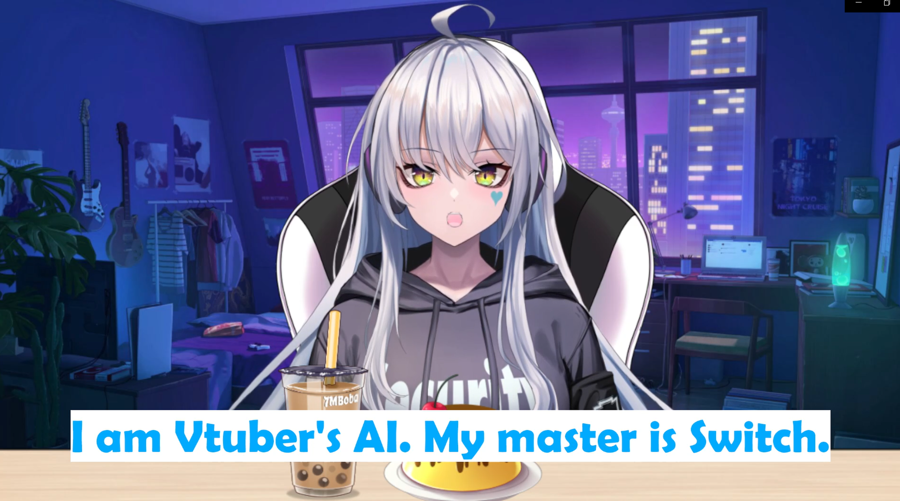

# VTuber's AI Anime

### Docker

To run Voicevox:

`docker-compose up -d`
To stop running the containers:
`docker-compose down`
If you're running Windows Subsystem for Linux (WSL) don't forget to shut it down to reclaim your ram. This should only after you have stopped the containers and are done using the program.
`wsl --shutdown`
